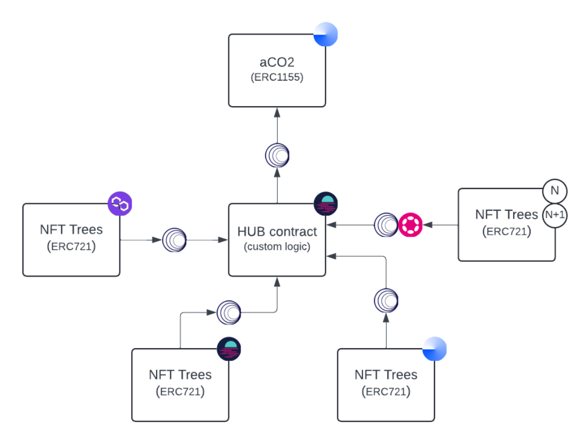

# Whormhole Carbify cross chain demo

This repository contains source code for the [Carbify](https://www.carbify.io) cross chain communication sample.
Carbify is an EcoFi RWA project. Their mission is to plant trees which reduce the Carbon footprint. Each tree is connected with an NFT.

The cross chain implementation of the project was developed by [Kalmia](www.kalmia.si).

The complete cross-chain solution is too complex to be presented in a brief overview. This source code provides an abstract representation of the functionality used in the 
Carbify system.
The complete case involves cross chain communication between the 7 contracts (aCO2, NTF tree batch, Landpolt, Marketplace, $CBY, aCO2 Pools contract, HUB contract).

In case of interest, a complete cross-chain solution can be presented and discussed.

Detailed presentation of this abstract sample can be viewed on [here](https://www.youtube.com/watch?v=qkqj4d4nWKw).

## Abstracted code

The code focuses on the following key components:

- NFT Tree contract on Alfajores.
- HUB contract on Moonbase Alpha.
- aCO2 token on Base Sepolia.

The solution facilitates the following cross-chain communications:

- Communication between the NFT Tree contract and the HUB.
- Communication between the aCO2 token and the HUB.



In our solution, users can mint and hold NFT Trees (ERC-721), which can exist on any blockchain. These trees generate aCO2 tokens (ERC-1155) periodically over time. Each tree is linked to aCO2 token. The aCO2 token is deployed on BASE. The logic for generating aCO2 tokens is stored in the HUB contract, which tracks the state of each NFT Tree. Specifically, the HUB contract needs to know the owner of each tree and the time elapsed since the last aCO2 token was generated. HUB contract is deployed on MoonBeam.

The state of HUB determine how users can claim aCO2 tokens. If an NFT Tree is transferred to another user, all unclaimed aCO2 tokens are credited to the previous owner.

### Flows

Typical cross-chain flows:

- A user mints an NFT Tree on Alfajores (Celo testnet). A cross-chain call is made to update the state on the Moonbase Alpha HUB.
- The user claims an aCO2 token on Moonbase Alpha. A cross-chain call is made to update the state of the aCO2 token on Base Sepolia.
- The user claims aCO2 tokens on Base Sepolia. A cross-chain call is made to verify the state on the HUB, and the aCO2 token balance is updated accordingly.

The code in this repository essentially supports two main flows:

1. Minting an NFT Tree: In this flow, the NFT Tree is minted on the Alfajores network. We expect the HUB contract to detect the minting event and record the state change in the HUB contract on Moonbase Alpha.

2. Transferring an NFT Tree: In this flow, the NFT Tree ownership is transferred on the Alfajores network. Along with updating the state in the HUB contract, we expect the aCO2 tokens to be automatically claimed on Base Sepolia as part of the transfer process.

### Getting Started

If you are new to Hardhat, please check the [Hardhat Getting Started Guide](https://hardhat.org/hardhat-runner/docs/getting-started#overview).

1. Clone and install dependencies:

   and then run:

   ```console
   yarn or v
   ```

2. Set up `.sample.secrets.json` file

   ```console
   mv .sample.secrets.json .secrets.json
   ```

3. Setup all the needed keys (baseSepoliaRPC, baseScanApiKey, moonbaseAlpha, celoTestnet,  arbitrumSepolia)

4. Compile the project

    ```console
    yarn hardhat compile or npx hardhat compile
    ```

5. Deploy

    Check the `hardhat.config.ts` file to find the network names. Then run:

   ```console
   npx hardhat run --network baseSepolia scripts/deploy-aco2.ts
   npx hardhat run --network moonbaseAlpha scripts/deploy-hub.ts
   npx hardhat run --network celoTestnet scripts/deploy-nft.ts
   ```

#### Initialize setup

To get the setup running, the following steps are required:

1. Set the hubAddress on the NFT Tree contract.
2. On the HUB contract, whitelist each NFT Tree you deploy and set the aCO2 token address.
3. Set the hubAddress on the aCO2 contract.

### Helper scripts

The repository contains helper scripts to facilitate quicker deployment and execution of the solution:

1. Account Creation: Use scripts/create-account.js to create a new account.
2. Mint NFT: Use scripts/nft-mint.js to mint an NFT Tree.
3. Transfer NFT: Use scripts/nft-transfer.js to transfer an NFT Tree.

## Pre-deployed contracts

- NFT Tree:
 https://alfajores.celoscan.io/address/0xAdB4f214Ee43866711e5De6dA0CEc8AedF8FC636

- HUB:
 https://moonbase.moonscan.io/address/0x33FdeB7577F4daAc5dcb09AD1A986B239a3322D2

- aCO2Token:
 https://sepolia.basescan.org/address/0xE83DE44dFc1Cb85Bc617f79b7F4Dcb9a88B2425a

--------------------------------------------------------------------

### Samples of cross chain transactions

- Mint:
 https://wormholescan.io/#/tx/0xf8496ebe3a63d0a92fbacb244378e3262c3a7fc44cfe7774fc2be023999c693d?network=TESTNET

- Transfer:
 https://wormholescan.io/#/tx/0x10be288a8b13de3539de10efa303ba6fc3f36dad28e64af3600910bfa729fdb6?network=TESTNET
